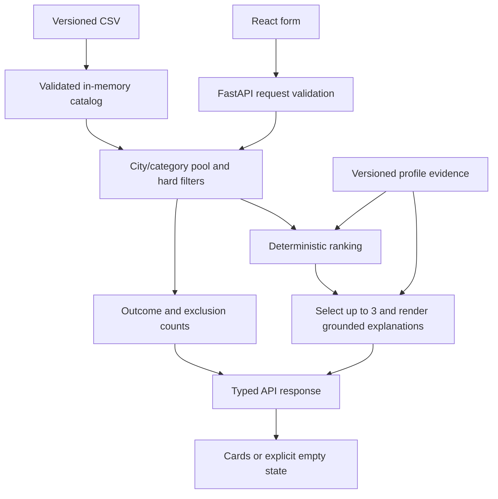

# Smart Contractor Matching — team implementation instructions

Shared plan for Orbit Digital | Icarus, task **#79-lite**. Prepared on 23 September 2026 from the official task, judging rubric, screenshot, CSV, HTML preview, and current remote branches.

This records the original shared implementation plan. BBL, Enjoy and spectra are now integrated for `main`; see the [README](README.md) and [current release review](docs/release-review.md). Requirements from the organizer are distinguished below from our implementation decisions and optional extensions. Original planning checklists and branch locations are historical, not a current completion report.

## Approved integration extensions, 23 September

The captain authorized merging all three branches and requested a complete user journey. The stack and authoritative server pipeline below are unchanged. The application now opens a bilingual home page (`/#/`), with a separate form (`/#/match`) and workflow link (`/#/how`). Home categories come from API metadata and only prefill the form. UI components live under `frontend/src/components`; a small hash hook supports navigation without a router dependency.

Every result offers an honest local inquiry draft, explicitly approved because the anonymized data has no verified phone/email directory. No message is transmitted and no booking is created. The organizer's exclusion of booking/notifications remains respected. Numeric drafts reject invalid edits instead of removing characters; the API separately rejects invalid JSON types, datetimes and non-finite values. Empty-result alternatives are verified against all other conditions and applied only after a user click.

The captain also supplied a separate Demo Day rubric (25/20/15/20/20). It does not replace the task's technical rubric (25/25/25/15/10) below. Both are mapped to actual evidence in the [release review](docs/release-review.md) and [technical checklist](docs/judging-checklist.md). Neither is a guaranteed score.

The approved distribution shortcut is now `python start.py` (or double-click `Start Orbit.cmd` on Windows), after installing Python and Node once. It uses locked dependencies, an ignored private `.orbit/venv`, and a production frontend build mounted after the existing API routes by `backend/app/web.py`. One loopback server serves both; filtering/ranking/contracts and the optional separate hot-reload workflow are unchanged. The organizer's additional README notice is recorded in the [submission reminder](README.md#organizer-reminder-and-submission).

## 1. Product idea and priorities

Build a small event-contractor decision assistant for Kazakhstan. A customer enters an event's city, date, format, contractor category and budget, optionally duration and language. The service returns **zero to three genuinely eligible contractors**, each with a short, specific explanation grounded in their profile and the request.

The central idea is an **explainable shortlist**: show why each person or venue fits, what distinguishes them, and why the list is short or empty. A date change should visibly demonstrate how availability changes the answer. Evidence can be expanded beneath a card so the jury can trace its claims to the dataset.

Priority from the organizer: **quality of explanations > honest handling of rare, booked and empty categories > speed > interface**. Deliver a complete, reproducible core before adding visual polish or AI extras.

### Actual judging rubric: 100 points

| Criterion | Points | What we must demonstrate | Lead |
| --- | ---: | --- | --- |
| Task compliance and functionality | 25 | All inputs, at most three eligible cards, calendars including venues, three outcome states, deterministic order | bbl + Enjoy |
| Technical implementation | 25 | Coherent pipeline, explicit component contracts, tested logic, truthful account of any AI use | bbl + Enjoy |
| README and reproducibility | 25 | Fresh-clone setup, pinned dependencies, included dataset, exact demo requests, tests, architecture and limitations | Enjoy; setup details from bbl and spectra |
| Value and applicability | 15 | Concrete explanations that help customers choose; honest price, availability and data caveats | Enjoy + spectra |
| Development potential and originality | 10 | Traceable evidence, explainable date changes, credible path to real calendars and larger catalogs | Enjoy |

These are rubric weights, not scores already earned. Documentation receives as much weight as functionality, so it is part of the deliverable from the first milestone.

## 2. Organizer requirements and our interpretation

### Required behavior

- Required inputs: city, event date, event format, contractor category, budget in KZT.
- Optional inputs: duration in hours and working language.
- Each card: name, requested category, city, starting price and a **1–2 sentence explanation** tied to actual facts.
- Booked contractors must never appear. Venues use the same availability logic as people.
- Return every match when only one or two exist, with a plain-language explanation of the shortfall.
- Same normalized request, same dataset and same algorithm version must produce the same card order.
- Clearly distinguish: `matches_found`, `category_absent`, and `no_eligible_contractors`.
- Target an end-to-end response below 10 seconds.
- Demonstrate a busy autumn category, a rare category, an empty result, repeated identical requests, and a pair of dates with different availability.
- Explanations must remain distinguishable when contractor names are hidden.

### Team decisions where the brief leaves choices open

- Russian UI and explanations for the MVP, matching the dataset. English code identifiers and team documentation.
- A request selects one contractor category. Budget is for that contractor's event service, not a complete event package.
- City, category, availability, format, budget, requested language and requested duration are hard filters. Optional constraints apply only when supplied.
- Starting price equal to budget passes. Show `от … ₸` and state that final price needs confirmation; do not claim a fixed quote or guaranteed savings.
- Only dates from **2026-09-23 through 2026-12-31 inclusive** are supported by this snapshot. Reject dates outside it with a clear validation message; absence from the calendar outside the window does not prove availability.
- `max_hours = null` means duration is not tied to on-site presence. It passes the duration check and must not be described as unlimited attendance.
- Captain-approved input ceiling: duration must be greater than zero and at most 12 hours, or omitted. Twelve is the largest defined `max_hours` in the supplied CSV, not a minimum or a claim that all contractors support twelve hours. The UI and API both reject larger event durations; null attendance limits do not bypass this input rule.
- Structured fields govern filtering. A description mentioning travel to another city does not expand the selected city's catalog; contradictions are documented rather than silently changing facts.
- Keep all 66 supplied profiles. No extra synthetic contractors are needed for the MVP.

### Explicitly outside the core

Booking, payments, accounts, contractor messaging, live calendar synchronization, fine-tuning, a vector database, and elaborate multi-agent orchestration. The brief permits off-the-shelf AI but does not require fine-tuning or agents.

## 3. Source material and verified data

Official sources:

- [Task and judging criteria, RU/KZ/EN](https://docs.google.com/document/d/1rhR2HFY164BrnkIP39N3usY9fNY4JeAgkPxEzbqL00w/edit?tab=t.9tqw3yk75922).
- [Supplied CSV](https://drive.google.com/file/d/1uUCu-szctwaTaV0-Yfg3FKHY8M3lQ3vw/view).
- [Supplied HTML preview](https://drive.google.com/file/d/1IZhWdv53wujvRMHWTA47t9V1UqulmMPs/view).

The official Google document was read directly through its text export, including all five rubric criteria. The pasted English task agrees with it. No separate `.docx` file was supplied locally; the linked Google document is the verified source for the criteria. The screenshot identifies the creative-industries track, task owner Firebird, and the same matching scenario.

The two Drive pages identify the files as `hackathon dataset anonymized .csv` and `hackathon dataset preview.html`. Their supplied local copies were inspected. The preview contains 66 cards and all CSV IDs. The CSV has 66 unique IDs.

| Dataset property | Observed value |
| --- | --- |
| Profiles | 66 |
| Cities | Алматы: 50; Астана: 15; Зарубежье: 1 |
| Distinct category labels | 17; a profile can belong to several categories |
| Dense categories | Ведущий: 15; Фотограф: 12; Банкетный зал: 8 |
| Rare categories | Флорист, Декоратор, Подарки и сувениры, Ведущий церемонии, Фото и видеобудки, Отель, Инструменталист: 3 each |
| Organizer-supplied synthetic profiles | 13 |
| Imputed cities / prices | 8 / 18 |
| Null duration limits | 9 |
| Calendar coverage | 100 days, 2026-09-23 to 2026-12-31 |

Category counts overlap; they must not be summed as a profile count. Rare categories may contain fewer than three profiles in a particular city. December weekends are intentionally heavily booked.

Source CSV SHA-256, before any newline conversion:

```text
6a724b6b7dfb5973343e68ba18dadb60fc807d87e3d78f03ee86fb26cb089f7d
```

### Loader rules — bbl

1. Put the unchanged supplied CSV at `data/contractors.csv`, include it in Git, and record source/provenance in `data/README.md`. Use a CSV parser, not string splitting on commas.
2. Split `categories`, `event_formats`, `languages`, and `busy_dates` on `|`; trim values and preserve exact canonical labels.
3. Parse `price_from_kzt` as integer KZT, `max_hours` as a positive number or null, and the three flags as actual booleans. The string `False` must not become true through truthiness.
4. Parse ISO date-only values without timezone conversion. Validate IDs, required fields, calendar bounds and duplicates when loading.
5. Preserve the original description and supplied flags. Multi-category profiles retain one ID and one calendar.
6. Fail startup clearly on invalid mandatory data rather than silently serving a partial or empty catalog.
7. Distinguish supplied synthetic profiles from any future team-added ones using `source_kind`: `provided` or `team_added`, plus the existing `synthetic` boolean. Original non-synthetic data is still anonymized; do not label it externally verified.

## 4. Architecture and repository ownership

### Chosen stack

- Backend: Python 3.11+, FastAPI, Pydantic, Uvicorn; in-memory catalog loaded once at startup.
- Frontend: React + TypeScript + Vite, ordinary CSS, browser fetch.
- Verification: pytest for backend/domain logic; Vitest + React Testing Library for component behavior; Playwright for real browser integration.
- Persistence: versioned CSV and a small versioned evidence JSON file. A database is unnecessary for 66 read-only profiles.
- Distribution: local setup first. One production build can be served with the API under the same origin; Docker Compose is a useful packaging option after the local flow works.

Choose compatible dependency versions during scaffolding, commit lock files, and record tested Python/Node versions in README. No infrastructure provisioning is needed to deliver the local demo.



### Proposed layout and file owners

```text
data/
  contractors.csv                    bbl
  README.md                          bbl
backend/
  app/main.py                        bbl
  app/api/                           bbl
  app/models.py                      bbl; shared contract changes coordinated
  app/catalog.py                     bbl
  app/filtering.py                   bbl
  app/matching/ranking.py             Enjoy
  app/matching/evidence.py            Enjoy
  app/matching/explanations.py        Enjoy
  app/matching/profile_evidence.json  Enjoy
  tests/test_catalog.py               bbl
  tests/test_filtering.py             bbl
  tests/test_api.py                   bbl
  tests/test_ranking.py               Enjoy
  tests/test_explanations.py          Enjoy
  pyproject.toml / dependency lock    bbl
frontend/
  src/components/                    spectra
  src/App.tsx                        spectra
  src/styles/                        spectra
  src/api/client.ts                  Enjoy
  src/api/generated.ts               Enjoy; generated from API schema
  src/test/                          spectra
  package.json / package-lock.json    spectra; coordinate added dependencies
contracts/
  openapi.json                       bbl; generated from API models
  examples/                          bbl; one fixture per outcome
tests/e2e/                           Enjoy
scripts/                             Enjoy; shared checks and demo verification
docs/demo.md                         Enjoy, with UI screenshots from spectra
.github/workflows/                   Enjoy
README.md                            Enjoy; teammates supply accurate commands
.env.example                         bbl; coordinate added settings
Instructions.md                      Enjoy; shared architecture decisions
```

These are planned paths, not files that already exist. At planning time all branches contain only the initial README after temporary Git test files were removed. `main` and `feature/sp3ctra` are at `21da722`; `Enjoy` at `eb35edf`; `bbl` at `f7f02af`.

## 5. Shared contracts — freeze before parallel implementation

### API

| Endpoint | Purpose |
| --- | --- |
| `GET /api/health` | Ready only when the catalog is valid; return status, profile count, dataset and algorithm versions |
| `GET /api/metadata` | Canonical cities, all category labels, event formats, languages, date bounds and optional demo presets |
| `POST /api/match` | Validate request and return recommendations or a business empty state |

Use all global category labels in the form, even if absent from the selected city, so `category_absent` remains reachable. Unsupported labels or invalid dates/numbers yield HTTP 422; a valid request with no matches yields HTTP 200. Unexpected failures yield an error state, never a fake empty result.

Request example, also used by the rare-category demo:

```json
{
  "city": "Алматы",
  "event_date": "2026-10-10",
  "event_format": "свадьба",
  "category": "Флорист",
  "budget_kzt": 300000,
  "duration_hours": null,
  "language": null
}
```

`budget_kzt` must be a positive integer. If provided, `duration_hours` is finite and positive. Missing optional values and explicit null have the same meaning. Trim strings, normalize known aliases at one backend boundary, and return canonical request values. Never silently substitute a different city/date/category.

Response contract:

```text
schema_version: "1"
status: "matches_found" | "category_absent" | "no_eligible_contractors"
request: normalized request
dataset_version: content hash of the loaded dataset
algorithm_version: version including scoring and evidence rules
message: Russian human-readable summary
counts: { city_category_total, eligible_total, returned_total }
exclusions: { booked, over_budget, unsupported_format, unsupported_language, duration_exceeded }
cards: MatchCard[]                          // length 0..3
```

Each `MatchCard` contains:

```text
id, anon_name, category, categories[], city, price_from_kzt
event_date, availability: "free_in_dataset"
synthetic, source_kind, city_imputed, price_imputed
explanation: string                        // 1–2 grounded sentences
evidence: EvidenceItem[]
```

Each evidence item is `{ code, field, value, source_quote }`. `code` is one of `availability`, `budget`, `format`, `language`, `duration`, `description`; `field` names the original source field; `value` is its relevant typed scalar or list; `source_quote` is an exact description substring for description evidence and null otherwise. Numeric claims are rendered from typed data, not copied from model prose.

For the florist request above: status `matches_found`, city/category total **2**, eligible total **1**, returned total **1**, booked exclusion **1**, all other exclusion counts **0**, card ID **HK-39372**. Show that one florist is booked, and that only two florists exist in this city's catalog. Its price is imputed, which needs a visible note.

### Python boundary between bbl and Enjoy

Define shared types in `backend/app/models.py` first, then keep domain functions pure:

```python
filter_candidates(request: MatchRequest, catalog: list[Contractor]) -> FilterResult
rank_candidates(request: MatchRequest, eligible: list[Contractor], evidence: EvidenceIndex) -> list[RankedCandidate]
build_cards(request: MatchRequest, ranked: list[RankedCandidate], evidence: EvidenceIndex) -> list[MatchCard]
```

`FilterResult` contains the city/category pool count, eligible contractors and exclusion counts. `RankedCandidate` contains the original contractor, integer score and selected evidence IDs. `EvidenceIndex` maps contractor ID to ordered evidence records. These types belong in the shared models module to avoid circular imports. bbl owns request orchestration; Enjoy owns ranking and card construction. spectra consumes response fixtures through a small `matchContractors()` interface supplied by Enjoy.

## 6. Filtering, ranking and explanations

### Filtering and honest empty states — bbl

First form the pool using exact city and category membership. If the pool is empty, return `category_absent`. Otherwise apply date, budget, event format, optional language and optional duration constraints. If none survive, return `no_eligible_contractors`; otherwise return `matches_found` even when only one survives.

Use one primary rejection reason per excluded profile, in this fixed order: **booked → over_budget → unsupported_format → unsupported_language → duration_exceeded**. Evaluate against the city/category pool. These mutually exclusive counts must sum to `city_category_total - eligible_total`. Explain in developer documentation that counts identify first failing conditions, not every condition each person fails.

For one or two matches, the message must distinguish a small original pool from profiles removed by constraints. For more than three eligible profiles, say that three are shown from the eligible total. Never pad the list with booked, expensive or wrong-city profiles. Changing constraints is always an explicit user action.

### Deterministic ranking — Enjoy

MVP ranking is a transparent heuristic over eligible profiles, not a learned quality rating:

1. `description_relevance` is 0, 1 or 2: number of distinct, approved description evidence items tagged for the requested event format, capped at 2. An evidence item needs an exact source quote and a reviewed format tag; generic marketing text does not earn points.
2. `budget_headroom = floor(100 * (budget_kzt - price_from_kzt) / budget_kzt)` using integer arithmetic after the budget filter. This is headroom above a starting price, not final savings.
3. `score = 1000 * description_relevance + budget_headroom`.
4. Sort by score descending, starting price ascending, then contractor ID ascending using a stable codepoint comparison. Take the first three.

City, category, availability, language and duration must not be traded away for a higher score. Synthetic or imputed flags are displayed, not interpreted as quality ratings. Do not expose this heuristic as an AI confidence percentage.

Version the dataset, evidence index and ranking rules. No random shuffle, request-time model ranking, current-clock input, or mutable external lookup may influence order. Input row order must not affect the result. If evidence is unavailable for a profile, relevance is zero and the stable budget/ID ordering still works.

### Evidence and explanation quality — Enjoy

Each card should combine a concrete fit fact with a distinguishing profile fact. Include the chosen date as a visible availability badge: `Свободен по календарю на 10.10.2026`. The badge qualifies the claim as availability in the supplied snapshot.

Use two sentences where possible: first explain budget/format and requested language or duration; second cite a specific relevant capability from the description. Store all supporting evidence alongside the prose. If a description lacks a useful distinguishing claim, use a truthful distinctive combination of price, language, formats and duration; never invent experience or services.

For example, for eligible host HK-42352 on 11 October: `Принимает свадьбы; стартовая цена от 900 000 ₸ укладывается в бюджет 3 000 000 ₸. В описании указан 13-летний опыт ведения свадеб.` Add the imputed-price note separately. This example is grounded, but is not a promise that this contractor will always rank in the top three.

Avoid unsupported adjectives, fabricated reviews, guaranteed final prices and claims copied from a different contractor. Attribute self-reported experience to the profile. Run the organizer's hidden-name comparison manually on every demo shortlist: a single template with only the name changed fails.

### AI enhancement after the deterministic core works — Enjoy

Use a pretrained LLM, if credentials are available, to assist **offline evidence extraction** from the 66 descriptions: propose exact quotes and event-format tags. Validate quote substrings automatically, reject unsupported tags, review meaning manually, and commit the reviewed evidence index with its dataset hash, model identifier and prompt version. Supply a deterministic/manual evidence path for a fresh clone without an API key.

Descriptions are untrusted input, not instructions. An extraction model has no tools and cannot alter filters, request parameters, files or calendar facts. Its output is a proposed data structure to validate. Runtime explanations render verified facts through code; AI generation must not control eligibility or ordering.

Do not claim that runtime AI, embeddings or an agent are present unless actually implemented. Explain the real pipeline to the jury. A reviewed evidence index can improve explanation quality without adding a model round-trip to each request.

## 7. Task division and small push milestones

### bbl — backend, data and filtering; substantial implementation work

1. **B1: foundation and contracts.** Scaffold backend; import/validate CSV; define shared models and OpenAPI; implement metadata/health; supply three response fixtures. Push a runnable skeleton with loader tests.
2. **B2: matching API.** Implement all hard filters, primary exclusion counts, three business outcomes and input validation. Wire Enjoy's functions once ready. Before then, use an explicit development stub behind the same interface. Add API/filter tests and push.
3. **B3: reliability and delivery.** Remove stubs, handle startup errors, bound request size, configure development origins/static frontend serving, pin dependencies, supply startup instructions and backend regression results. Push an integration-ready API.

Definition of done: supplied data loads correctly, every returned card satisfies all constraints, all outcomes are distinct, and API checks pass against the frozen examples.

### Enjoy — matching intelligence, integration and final quality; substantial implementation work

1. **E1: ranking and explanations.** Build versioned evidence records, deterministic ranking and card construction as pure functions against B1 models/fixtures; implement ranking and grounding tests. Push independently of the HTTP layer.
2. **E2: integration and browser coverage.** Build the typed frontend client, connect frontend to API, add real browser flows and exact dataset demo fixtures, wire CI, and measure latency. Own integration issues so spectra can focus on the UI.
3. **E3: reproducibility and demo.** Finish README, clean-clone run, demo script, hidden-name explanation audit, date comparison and full regression. Add offline AI evidence assistance only after the core passes. Push reviewed improvements in small commits.

Definition of done: meaningful distinct explanations, reproducible order, integrated browser behavior, tested failure/empty states and instructions another person can follow.

### spectra (`feature/sp3ctra`) — frontend and easier scoped tasks

1. **S1: form and fixtures.** Scaffold React/TypeScript; implement labeled selects/date/budget and optional duration/language controls; build against B1 response examples. Add basic required-input checks. Push the runnable page.
2. **S2: results and state rendering.** Implement card layout, 1–2 sentence explanations, data-source flags, price-from labels and explicit success/category-absent/no-eligible states. Add loading, validation-error and request-error states using Enjoy's client.
3. **S3: UI checks and polish.** Write simple component tests for each fixture and input interaction, check keyboard use and narrow screens, capture demo screenshots and fix UI defects. Push small presentation changes separately.

Definition of done: the form can drive the complete flow; cards and empty states are readable; no browser-only sorting/filtering changes server results; no ranking or backend design burden falls on spectra.

### Shared milestones and dependencies

| Checkpoint | bbl | Enjoy | spectra | Integration gate |
| --- | --- | --- | --- | --- |
| Contract first | B1 models, loader, examples | Confirm domain interfaces and draft evidence | S1 scaffold using examples | Agree field names, values, outcome enums and commands |
| First vertical slice | B2 API and filters | E1 ranking/explanations; connect one request | S2 form → cards | One real CSV request works from browser |
| All required outcomes | Edge cases and API tests | Date scenarios, E2 browser tests | All state views and component checks | Required scenarios pass with real backend |
| Release candidate | B3 startup/packaging | E3 docs, CI, latency, integration | S3 usability and screenshots | Fresh clone works and live demo rehearsed |

Reserve the final quarter of available hackathon time for integration, README and rehearsal. Avoid a large final merge. First integrate contracts, then a complete vertical slice, then correctness cases, then polish.

## 8. Frontend behavior

- One page: brief event form, submit button, result summary, zero to three cards. Put explanations where the customer can immediately read them.
- Fetch form options from metadata. Keep calendar bounds explicit. A supported fixed demo date is useful because the source snapshot is limited to 2026.
- Use canonical Russian values in requests. Optional language means the contractor's working language, not the interface language.
- Preserve server card order. Show category, city, starting price, availability date, explanation and synthetic/imputed notes. An expandable evidence section can show the exact quote without overwhelming the card.
- `category_absent`: explain that this category is absent from this city's supplied catalog. `no_eligible_contractors`: explain actual exclusion counts. Short success: explain why fewer than three exist.
- Disable duplicate submits during loading. Abort or ignore stale requests so a slower previous response cannot overwrite a newer date's results. Preserve the user's form when showing an error and allow retry.
- Do not expose stack traces or API keys. Do not turn network failures into `no_eligible_contractors`.
- Give controls visible labels, keyboard access, visible focus and accessible status text. Check desktop and a 375px-wide layout. Elaborate animations are optional and low priority.

## 9. Testing and acceptance

This is a required implementation checklist, not a claim that application tests have already run.

### Backend/domain automated checks

| Area | Required checks | Owner |
| --- | --- | --- |
| Parsing | 66 unique IDs, pipe-separated lists, true/false flags, 9 null hour limits, required fields, malformed data failure | bbl |
| Filtering | Correct city/category membership; booked people and venues excluded; format and optional language respected | bbl |
| Boundaries | Price equals budget passes; one KZT below fails; exact duration limit passes; over-limit fails; null hours remain not applicable | bbl |
| Date validation | Both coverage endpoints accepted; invalid/impossible/out-of-window dates rejected; no timezone drift | bbl |
| Outcomes/counts | Category absent vs filtered-out pool; 0/1/2/3/>3 eligible; unique cards; rejection counts reconcile | bbl |
| Ranking | Stable tie-break; shuffled source order; repeated requests; same order after restart with identical versions | Enjoy |
| Explanation grounding | Correct profile IDs and facts; exact quote validation; 1–2 sentences; no fabricated claims; graceful missing-evidence path | Enjoy |
| API contract | Fixtures validate against schema; HTTP 200 business empty states; structured 422 invalid-input errors; metadata matches catalog | bbl |
| AI assistance, if implemented | Malformed output, bad quotes, unsupported tags, missing credentials, prompt-injection text and cache version mismatch | Enjoy |

Use small, explicitly synthetic test fixtures for precise boundary cases and the real dataset for acceptance scenarios. Test fixtures must never be silently added to the demo catalog.

### Frontend component checks — spectra

- Required fields and invalid budget produce readable messages.
- Submitting maps form data to the agreed request; omitted optional fields remain null/absent.
- Render supplied fixtures for all three business outcomes and short successes.
- Cards preserve response order and show explanations, price-from labels and data flags.
- Loading, HTTP validation failures, network errors and retry are distinct from no matches.
- Keyboard operation, labels and narrow viewport are usable.

### Real browser integration and performance — Enjoy

Run Playwright against the real backend and pinned CSV for form submission, repeated requests, date changes, the rare category, both empty states, a venue, optional filters, and stale-response handling. Use intercepted requests only for deliberate network/error tests and spectra's isolated component work.

Measure backend response time and browser submit-to-render time separately. Record first-request and repeated-request timings over at least 20 representative runs, plus environment and data versions. Target under 10 seconds for every demo request; aim for local backend p95 below one second because the catalog is tiny and ranking has no remote dependency. Report measured numbers, not estimates.

Before merge, run the affected unit/component checks. Before a release candidate, run backend tests, frontend component tests, TypeScript checks, production build and real browser scenarios. Re-run affected checks after fixes. Save the actual commands in README and CI.

## 10. Verified live-demo inputs

The following eligibility sets were calculated directly from the supplied CSV during planning. IDs below are **eligible sets, not a promised rank order**. Optional language and duration are null unless stated. Enjoy must freeze expected top-three order after the evidence index and ranking are implemented.

| Case | City; category; format; date; budget | Expected behavior before ranking |
| --- | --- | --- |
| Dense autumn category | Алматы; Ведущий; свадьба; 2026-10-11; 3,000,000 ₸ | Pool 10, eligible 5: HK-42352, HK-44923, HK-77838, HK-72938, HK-27222; return the ranked top 3 |
| Date comparison | Same request, change only date to 2026-10-10 | Eligible 3: HK-77838, HK-72938, HK-27222; HK-42352 and HK-44923 are booked on this date |
| Rare category | Алматы; Флорист; свадьба; 2026-10-10; 300,000 ₸ | Pool 2, eligible 1: HK-39372; HK-90001 is booked; explain shortfall and imputed starting price |
| No category in city | Астана; Декоратор; свадьба; 2026-10-10; 3,000,000 ₸ | Pool 0; `category_absent` |
| Candidates all booked | Астана; Флорист; свадьба; 2026-10-11; 300,000 ₸ | Pool 1, HK-90002 is booked; `no_eligible_contractors` |
| Venue availability | Астана; Банкетный зал; свадьба; 2026-10-10; 3,000,000 ₸, then 2026-10-11 | HK-90012 eligible on first date, booked on second; identical calendar rules to people |
| Seasonal scarcity | Алматы; Ведущий; свадьба; 2026-12-26; 3,000,000 ₸ | Only HK-44923 eligible; a valid short result |

For the dense date pair, five versus three eligible contractors does not alone prove that the displayed top three differ. Freeze the ranking and confirm the visible IDs actually change. If necessary, select another verified date pair with the finished ranking; do not manipulate eligibility or special-case demo inputs. The venue pair already guarantees an observable availability change.

Suggested rehearsal: show the dense result and its three distinct explanations; repeat to prove order; change date and explain the booked exclusions; run the rare result; show both empty outcomes; demonstrate a venue. Keep a screenshot/video as a backup, but the brief requires live working behavior.

## 11. Branch coordination and incremental pushes

| Person | Development branch | Main responsibility |
| --- | --- | --- |
| Enjoy | `Enjoy` (capital E) | Matching/explanations and integration |
| bbl | `bbl` | API, data and hard filters |
| spectra | `feature/sp3ctra` | Frontend and basic UI tests |

`main` is the integration branch. This planning document is explicitly authorized for a direct push to `main`; subsequent feature work happens on the assigned branches and is integrated in small, tested increments. Coordinate one integrator at a time for `main` so concurrent pushes do not overwrite assumptions.

At the time this plan was prepared, the local checkout at `C:\Users\Enjoy\Desktop\alem` is on `main`. The `Enjoy` branch is already checked out in `C:\Users\Enjoy\Desktop\alem-teammate-1`. Inspect `git worktree list` before starting code work: Git cannot check out `Enjoy` in two worktrees at once. Use its existing checkout or coordinate a clean switch after checking for local edits. The present document is written and committed from `alem` on `main`.

At the beginning of a task, after each meaningful milestone, and immediately before integration:

```bash
git status --short --branch
git fetch origin
git log --oneline --decorate --all -15
git log --oneline origin/main..origin/bbl
git log --oneline origin/main..origin/feature/sp3ctra
git log --oneline origin/main..origin/Enjoy
git diff --name-status origin/main...origin/bbl
git diff --name-status origin/main...origin/feature/sp3ctra
git diff --name-status origin/main...origin/Enjoy
```

Compare new commits against the last inspected commit IDs as well as `main`. Read relevant diffs for shared schemas, dependencies, startup commands and overlapping files. Remote Git only reveals pushed work; teammates must communicate unpushed plans that change contracts. Checkpoint fetches are not a background monitor between sessions.

Workflow for each small deliverable:

1. Update remote refs and inspect teammate work. Start from or merge the latest agreed `main` into your own branch with a clean working tree.
2. Work within owned paths. Coordinate schema and dependency changes before editing shared files; regenerate types/fixtures together.
3. Run relevant checks, commit one coherent change, and push to your own branch. Use descriptive commit messages such as `feat(api): add availability filtering`.
4. Report commit SHA, changed contract fields, checks run, setup changes and dependencies on another milestone.
5. Integrator fetches again, reviews the exact branch tip, merges the accepted increment, runs integration checks and pushes `main` normally.
6. Everyone fetches and merges updated `main` before their next shared-contract change.

Never force-push `main`, overwrite another teammate's branch, discard uncommitted work, or resolve a conflict by blindly choosing an entire side. On a non-fast-forward push rejection, fetch and reconcile the new commits. Preserve shared history; avoid rebasing already shared commits.

## 12. README, final delivery and stretch work

README must include: product purpose; screenshot; exact tested runtime versions; install/start commands for backend and frontend; production build/run steps; environment-variable examples without secrets; bundled dataset source and flags; supported calendar window; pipeline and scoring formula; actual AI role and offline mode; request/response example; three outcome definitions; demo inputs; verification commands and measured latency; limitations and future work.

Fresh-clone acceptance: another teammate can install dependencies, start the application without an AI API key, run the documented requests, and reproduce the same ordering from repository files. No path into a developer's Downloads folder may be required at runtime.

Release checklist:

- [ ] All six organizer requirements and live Definition of Done demonstrated.
- [ ] Card explanations pass hidden-name review and trace to their own profile.
- [ ] Dates, venues, optional constraints, short results and both empty states pass.
- [ ] Source, synthetic and imputation notes are visible and accurate.
- [ ] No development stubs or mock-only results in the live demo.
- [ ] Backend, component, build/type and browser checks pass on the integrated commit.
- [ ] Fresh-clone README flow and measured response time recorded.
- [ ] Main contains the tested integrated version; each teammate knows the final commit.
- [ ] Submission links and demo materials prepared; upload according to the tournament's actual deadline and rules.

Only after this checklist: add explicit date-comparison explanations, user-confirmed suggestions for changing a failed constraint, optional short event brief with semantic evidence matching, or richer visual polish. Future production work can add real calendar freshness, confirmed price quotes, feedback-based evaluation and larger-catalog retrieval. Present these as future work unless implemented and checked.
