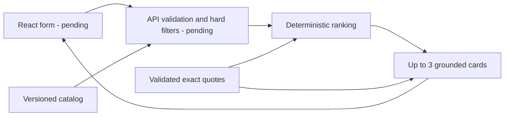

# Smart Contractor Matching

Orbit Digital | Icarus · hackathon task **#79-lite**

An explainable shortlist for event planning in Kazakhstan: enter city, date, event format, contractor category and budget, and receive zero to three eligible contractors with specific, traceable reasons. The shortlist prioritizes evidence about the requested event format, then starting-price headroom. It never fills empty places with booked or otherwise ineligible profiles.

**Current delivery status:** Enjoy's deterministic matching core, curated evidence, typed frontend API client and acceptance tooling are implemented. The production API, production data loader and React interface owned by bbl and spectra are still awaiting integration. You can reproduce matching and run the checks below now; this commit does not yet provide a complete web application or a verified browser demo.

## Reproduce the implemented part

Prerequisites: Git, Python **3.11+**, and Node matching **`^22.12.0 || ^24.0.0 || >=26.0.0`** with npm. Tested locally with Python **3.12.10**, Node **26.7.0**, npm **11.19.0**, and Windows 11. The matching core and dataset acceptance tool use only the Python standard library. No AI API key, account or paid service is required.

```bash
git clone https://github.com/BAITC-Hacks/hack-890ebfb3-orbit-digital-icarus.git
cd hack-890ebfb3-orbit-digital-icarus
git switch Enjoy
python -m unittest discover -s backend/tests -p "test*.py" -v
python scripts/matching_acceptance.py --repeat 20
python scripts/validate_evidence_proposal.py --input backend/app/matching/profile_evidence.json
```

The acceptance command prints eight real-dataset scenarios, ordered contractor IDs, explanations, exclusion counts, versions and measured domain execution times. Add `--json` to include full cards and supporting evidence. It loads the bundled `data/contractors.csv`; no file from a developer's Downloads folder is needed. The proposal validator checks an evidence artifact before it is adopted, including its connection to the source catalog; it does not call a model or establish that a profile's claims are independently true.

To install the locked integration development tools and check the frontend transport:

```bash
npm ci
npm run test:client
npm run typecheck:client
npm run test:e2e:list
```

The root package pins Vitest **5.0.1**, Playwright **1.63.0**, and TypeScript **5.8.3**. Commit and use `package-lock.json`; prefer `npm ci` for reproduction. These are integration tools, not the still-pending React application's runtime dependencies.

## Repository map

| Path | Purpose / owner |
| --- | --- |
| `backend/app/matching/` | Enjoy: pure ranking, quote validation and card construction |
| `backend/app/matching/profile_evidence.json` | Versioned evidence tied to the exact CSV hash |
| `backend/tests/test_matching*.py`, `test_evidence_proposal.py` | Enjoy: synthetic boundary, real-dataset and evidence-proposal checks |
| `data/contractors.csv` | The unchanged, organizer-supplied 66-profile catalog |
| `frontend/src/api/` | Enjoy: typed HTTP client, response checks and transport tests |
| `scripts/matching_acceptance.py` | Independent reference CSV/filter adapter and domain acceptance report |
| `scripts/check_api.py` | Check a running API against the independent dataset oracle |
| `scripts/validate_evidence_proposal.py` | Validate proposed offline evidence before adopting it |
| `tests/e2e/`, `playwright.config.ts` | Authored real-browser acceptance suite; execution pending integration |
| `.github/workflows/enjoy-checks.yml` | Matching/client checks in CI; inspect the workflow run for its actual result |
| `Instructions.md` | Shared task interpretation, architecture, ownership and milestone plan |

The reference CSV/filter adapter in `scripts/` is test tooling. The production backend must supply request validation, loading, filtering, outcome messages and HTTP endpoints. See [integration handoff](docs/integration.md) for the Python boundary and [browser contract](docs/browser-contract.md) for the frontend hooks and pending integration checks.

## Matching logic

The planned full flow is below; the matching/evidence components are implemented, while the web UI and production API/filtering are pending.



City and category first define the candidate pool. Date, budget, supported event format, optional language and optional duration are hard constraints. The current reference filter implements the agreed rules for testing; ranking and card construction additionally reject ineligible inputs as an integration safeguard. Ranking does not substitute for the API's input validation.

For each eligible profile:

```text
relevance = min(2, number of distinct reviewed quotes tagged for the requested format)
headroom = floor(100 × (budget_kzt − price_from_kzt) / budget_kzt)
score = 1000 × relevance + headroom
order = score descending, starting price ascending, contractor ID ascending
```

Card construction takes the first three. Generic claims have no format tags and earn no relevance points. Headroom is measured above a **starting price**, not a final saving or guaranteed quote. The score is an explainable heuristic, not an AI confidence percentage or a contractor quality rating. Synthetic and imputed flags do not alter ranking.

The same normalized request, dataset and evidence/ranking version produce the same order, including after input-row shuffling. There is no random shuffle, runtime model call, mutable external lookup or current-clock input. `algorithm_version()` combines `explainable-v1` with a digest of the evidence content; scoring changes must bump the ranking version.

### Explanations and the actual AI role

Cards use two sentences: concrete date/format/budget fit, then an exact profile quote or a structured-fact fallback. Optional language and duration facts are included when requested. Every assertion carries evidence with `code`, `field`, `value` and `source_quote`; description quotes must occur in that contractor's own description.

The coding assistant read all 66 descriptions and curated **99 exact quote records**, with conservative format tags. Six weak attribution/marketing records are excluded from explanation prose through `use_in_explanation: false`. The method is accurately labeled **`agent-reviewed-extractive`**: this is a committed artifact prepared during development, with no independent human verification of profile claims and **no runtime LLM or agent service**. Descriptions are data, never instructions. Fresh clones use exactly the same evidence without credentials.

The loader rejects mismatched source hashes, unknown contractor IDs, fabricated quotes, unsupported tags and malformed records. Missing evidence for an otherwise known profile falls back to budget/ID ordering and truthful structured facts; a broken evidence file is an error. See the [evidence review](docs/evidence-review.md) for semantic decisions and sparse-profile limitations.

## Dataset and honest constraints

The source is the organizer's anonymized catalog: **66 profiles**, **17 overlapping category labels**, **13 supplied synthetic profiles**, **8 imputed cities**, **18 imputed starting prices**, and **9 null duration limits**. Cities are Алматы, Астана and Зарубежье. Multi-category profiles retain a single identity and calendar.

Source files: [CSV](https://drive.google.com/file/d/1uUCu-szctwaTaV0-Yfg3FKHY8M3lQ3vw/view), [HTML preview](https://drive.google.com/file/d/1IZhWdv53wujvRMHWTA47t9V1UqulmMPs/view). The [official task and judging criteria](https://docs.google.com/document/d/1rhR2HFY164BrnkIP39N3usY9fNY4JeAgkPxEzbqL00w/edit?tab=t.9tqw3yk75922) and detailed interpretation are linked in [Instructions.md](Instructions.md).

Pinned CSV SHA-256:

```text
6a724b6b7dfb5973343e68ba18dadb60fc807d87e3d78f03ee86fb26cb089f7d
```

- Calendar coverage is **2026-09-23 through 2026-12-31 inclusive**. Other dates must be rejected by the production API. Free means free in this supplied snapshot, not a confirmed live reservation.
- Prices are positive integer KZT and displayed as `от … ₸`. Equality with the budget passes; a final quote requires confirmation. An imputed price is explicitly marked in the card payload for the UI to explain.
- `max_hours = null` means attendance duration does not apply to the service. It does not promise unlimited on-site attendance.
- Optional language refers to the contractor's working language. Empty optional values normalize to null.
- The payload preserves `synthetic`, `city_imputed`, `price_imputed` and `source_kind`. All bundled profiles have `source_kind: provided`; synthetic profiles were supplied by the organizer, not silently added by the team.
- A travel claim in a description does not override the structured city. Descriptive marketing does not override availability, prices or other hard filters.

Only one primary exclusion is counted per profile, in this order: `booked → over_budget → unsupported_format → unsupported_language → duration_exceeded`. Counts describe the first failed condition, not every failed condition. They sum to the city/category pool minus the eligible count.

## API contract and pending application startup

The typed client implements the agreed endpoints: `GET /api/health`, `GET /api/metadata`, and `POST /api/match`. Its default is same-origin `/api`; callers may supply `baseUrl` and `AbortSignal`. It preserves server ordering, rejects malformed successful responses, exposes HTTP 422 field errors, and keeps network/server failures separate from business-empty results. These TypeScript declarations are manually aligned with the shared contract; OpenAPI generation awaits bbl's schema.

Example match request:

```json
{
  "city": "Алматы",
  "event_date": "2026-10-10",
  "event_format": "свадьба",
  "category": "Флорист",
  "budget_kzt": 300000,
  "duration_hours": null,
  "language": null
}
```

Its verified domain result contains one card, HK-39372, from a pool of two florists; the other florist is booked. The card's starting price is 200,000 KZT and is imputed. The API envelope must add `schema_version`, normalized `request`, dataset/algorithm versions and a Russian summary to the tested `status`, `counts`, `exclusions` and `cards`.

| Outcome | Meaning |
| --- | --- |
| `matches_found` | At least one eligible profile; return at most three, without padding a short list |
| `category_absent` | No profiles in the requested city's category pool |
| `no_eligible_contractors` | The pool exists, but every profile fails a hard constraint |

Valid business-empty requests use HTTP 200. Invalid fields or unsupported dates must use HTTP 422. A network or server failure must be displayed as an error, not as an empty recommendation.

**Pending launch step:** a backend scaffold has been published on `main`, with a root `pyproject.toml` and a FastAPI entrypoint, but its production endpoints/catalog/filtering are still awaiting implementation and integration. The React/Vite application is also pending. Do not treat the following commands as a working full-app setup yet. The scaffold's backend command and the planned frontend command are:

```bash
python -m uvicorn backend.app.main:app --host 127.0.0.1 --port 8000
npm --prefix frontend run dev -- --host 127.0.0.1
```

They run in separate terminals. The incoming root `pyproject.toml` lists FastAPI, Pydantic and Uvicorn, with pytest/httpx as development extras; its dependencies are not yet pinned. bbl must finalize reproducible backend installation and configuration, and spectra must supply frontend installation/build commands. The frontend will need a `/api` proxy or an explicit API base URL plus backend CORS. Production build/static serving, environment examples, screenshots and full-app launch verification remain integration deliverables; there is no deployable production build claimed here. Reconcile Playwright's provisional auto-start command with the finalized entrypoint during this integration.

Once the real services are available:

```bash
python scripts/check_api.py --base-url http://127.0.0.1:8000 --repeat 20
npx playwright install chromium
npm run test:e2e
```

The HTTP checker verifies actual outcomes, counts, exclusions, ordered IDs and explanations against the independent dataset oracle, and rejects an out-of-window date. The browser suite drives the real form and compares the API response to rendered cards, including failure/retry and delayed responses. Set `RUN_APP_SERVERS=1` to let Playwright start both default development servers, or use `E2E_BASE_URL` / `E2E_API_URL` for already-running services. See [browser setup and limitations](docs/browser-contract.md).

## Verification status and measurements

| Check | Current evidence |
| --- | --- |
| Python matching / dataset / proposal tests | 28 passing; deterministic order, eligibility guardrails, boundaries, grounding, fallback behavior and eight proposal-validation checks |
| Frontend transport tests | 32 passing; requests, abort signals, validation/server/network failures and malformed response handling |
| Transport TypeScript check | Passing strict type check |
| Domain acceptance | 8 scenarios × 20 repeats = 160 timed runs; source order reversed and outputs unchanged |
| Browser test discovery | 8 Chromium tests discovered successfully; this is not a browser execution result |
| Real HTTP / browser / production build | Pending bbl and spectra integration; no success or latency claim yet |

These passing results were obtained locally. GitHub Actions did not start its job because GitHub reports the account is locked due to a billing issue. CI is therefore blocked by the account state; that run provides no evidence of a workflow-code or application-test failure. Re-run CI after the repository owner resolves the account issue.

A domain-only measurement on **23 September 2026**, Windows 11 `10.0.26200`, Python 3.12.10, dataset hash above, algorithm `explainable-v1:2553919e464d7030`: **p95 0.083 ms; maximum 0.095 ms** across the 160 repeated evaluations. Scenario first-evaluation times were 0.008–0.175 ms. Parsing/loading happened before these timings. This is in-process reference filtering/ranking/explanation time; it excludes server startup, HTTP, browser rendering and dependency installation. Timing varies by machine and load. Run the command yourself to obtain current figures; the full user-flow target remains under ten seconds and requires the pending integrated measurements.

## Demo, value and remaining work

Use [the demo script](docs/demo.md) for exact requests and frozen card order, the date change, rare category, both empty states, venue calendar and hidden-name explanation review. The practical value is a short list whose reasons can be checked against source facts, with clear explanations when only one candidate exists or nobody fits.

| Judging criterion | Points | Evidence and remaining integration |
| --- | ---: | --- |
| Task compliance / functionality | 25 | Real-data domain scenarios and constraint checks; complete browser flow pending |
| Technical implementation | 25 | Pure deterministic core, validated evidence, typed transport, independent oracle and shared contracts; API/UI wiring pending |
| README / reproducibility | 25 | Bundled data, locked tools, exact runnable commands, versions and demo inputs; full-app clean-clone run pending |
| Value / applicability | 15 | Specific quotes, transparent short results and price/calendar caveats; customer-facing display pending |
| Development potential / originality | 10 | Traceable offline evidence and visible date-sensitive changes; proposed next steps below |

Remaining release work: integrate bbl's API and loader, connect spectra's UI to the shared client, run all backend/component/build/browser checks, measure HTTP and browser latency, rehearse the live demo and reproduce the complete setup from a clean clone. A screenshot will be added from the real integrated UI.

Future extensions could add real calendar freshness, confirmed quotations, customer-approved constraint changes, quality evaluation using feedback, and retrieval for a larger catalog. They are proposals, not implemented features. Sparse original descriptions still limit explanation richness; the application does not verify claims, negotiate, book, charge customers or guarantee contractor quality.

Development branches: `Enjoy` owns matching/integration, `bbl` owns the API/data/filtering, and `feature/sp3ctra` owns the UI. Small increments are pushed to the owner's branch; shared contracts and fresh remote updates must be checked before integration into `main`. See [team workflow](Instructions.md#11-branch-coordination-and-incremental-pushes).
