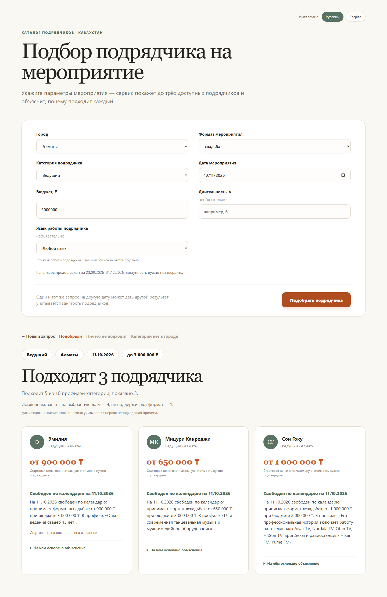
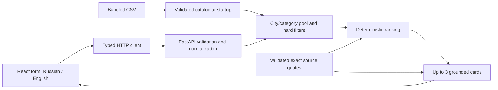

# Smart Contractor Matching

Orbit Digital | Icarus · hackathon task **#79-lite**

Find an event contractor in Kazakhstan without searching a long catalog. Enter the city, date, event format, category and budget to receive **up to three eligible profiles**, each with a short explanation and inspectable evidence. A date change can change the shortlist; a rare category can return one card; an empty result explains what prevented a match.

**The integrated local application works on the `Enjoy` branch:** React interface, FastAPI service, production filtering, deterministic ranking and grounded explanations. Russian is the default interface; a separate English switch preserves Russian source quotes and canonical request values. This is a local hackathon demonstration; it has not yet been released to `main` or deployed as a booking service.



[View the English interface](docs/images/interface-en.png) · [Demo walkthrough](docs/demo.md) · [Judging checklist](docs/judging-checklist.md)

## Run from a fresh checkout

Prerequisites: Git, **Python 3.11+**, and Node matching **`^22.12.0 || ^24.0.0 || >=26.0.0`**, with npm. Local verification used Windows 11, Python **3.12.10**, Node **26.7.0** and npm **11.19.0**. No API key, model account, database or environment file is required.

Run all commands below from the repository root:

```bash
git clone https://github.com/BAITC-Hacks/hack-890ebfb3-orbit-digital-icarus.git
cd hack-890ebfb3-orbit-digital-icarus
git switch Enjoy
python -m venv .venv
```

Activate the environment in Windows PowerShell:

```powershell
.venv\Scripts\Activate.ps1
```

Or on macOS/Linux:

```bash
source .venv/bin/activate
```

Install the locked Python, root integration and frontend dependencies:

```bash
python -m pip install -r requirements-dev.lock
python -m pip install -e ".[dev]" --no-deps
python -m pip check
npm ci
npm --prefix frontend ci
npx playwright install chromium
```

The browser installation is needed for browser checks. On Linux machines missing browser system libraries, use `npx playwright install --with-deps chromium` instead.

**Terminal 1 — backend**, with the Python environment activated:

```bash
python -m uvicorn backend.app.main:app --host 127.0.0.1 --port 8000
```

**Terminal 2 — frontend**, from the same repository root:

```bash
npm --prefix frontend run dev -- --host 127.0.0.1 --port 5173 --strictPort
```

Open **http://127.0.0.1:5173**. The frontend proxies `/api` to port 8000. API documentation is at **http://127.0.0.1:8000/docs**, and `/api/health` reports readiness after the catalog and evidence validate successfully. Keep both terminals running for the HTTP and real-browser checks below. If a port is occupied, stop the conflicting service; `--strictPort` prevents silently opening a different frontend port.

The catalog is bundled as `data/contractors.csv`. Setup and matching do not read a developer's Downloads folder or contact an AI provider. `VITE_API_MODE=demo` is an explicit, visibly labeled design-preview option; leave it unset for the real application. API errors never switch to preview data.

### Build and preview

```bash
npm --prefix frontend run build
npm --prefix frontend run preview -- --host 127.0.0.1 --port 4173 --strictPort
```

The build runs the application TypeScript check and writes `frontend/dist`. Keep the backend running on port 8000 and open **http://127.0.0.1:4173** to check the built bundle locally. Its `/api` proxy and the dense shortlist were verified. This preview is a local build check; an internet deployment still needs a hosted backend and a same-origin `/api` reverse proxy. Static files alone do not provide matching.

## Try the main scenario

1. Use **Алматы / Ведущий / свадьба / 2026-10-11 / 3,000,000 ₸**, leaving duration and contractor language blank. Five profiles qualify; the first three are `HK-42352 → HK-44923 → HK-27222`.
2. Expand a card's evidence, then switch to English. Interface text and reviewed quote translations change; the IDs, ordering and contractor-language filter stay the same. The original Russian quote remains inspectable.
3. Change only the date to **2026-10-10**. The shortlist becomes `HK-27222 → HK-77838 → HK-72938` because availability and the eligible pool change.
4. Try **Алматы / Флорист / свадьба / 2026-10-10 / 300,000 ₸**. One card, `HK-39372`, is returned. The other florist is booked; the 200,000 ₸ starting price is explicitly marked as imputed.
5. Compare **Астана / Декоратор** with **Астана / Флорист / 2026-10-11 / 300,000 ₸**. The first category is absent in the city; the second exists but has no eligible profile.

All dates are in 2026 and prices are per contractor's service. See the [complete demo](docs/demo.md) for the venue date pair, December scarcity, exclusion counts and explanation audit.

## Architecture and repository map



| Path | Responsibility |
| --- | --- |
| `backend/app/catalog.py`, `models.py`, `normalization.py` | Catalog loading, typed boundaries and canonical request validation |
| `backend/app/filtering.py` | Hard constraints and first-failure exclusion counts |
| `backend/app/matching/` | Ranking, evidence validation and card construction |
| `backend/app/api/routes.py`, `main.py` | HTTP responses, startup validation and dataset/algorithm versions |
| `data/contractors.csv` | Unchanged organizer-supplied 66-profile catalog |
| `frontend/src/App.tsx`, `frontend/src/styles/app.css` | Form, cards, evidence, loading/error states and responsive presentation |
| `frontend/src/api/` | Typed transport, runtime response checks and opt-in design preview |
| `frontend/src/i18n/` | Russian/English labels, evidence translations and locale checks |
| `contracts/` | Published OpenAPI contract and three response examples |
| `backend/tests/`, `frontend/src/**/*.test.ts` | Backend, transport and localization checks |
| `tests/ui/`, `playwright.ui.config.ts` | Isolated browser checks with explicitly mocked API responses |
| `tests/e2e/`, `playwright.config.ts` | Browser acceptance against the running application |
| `scripts/` | Independent dataset oracle, live HTTP checks, browser timing and offline evidence review tools |
| `.github/workflows/enjoy-checks.yml` | Locked setup, tests, build and real-browser CI workflow |
| `Instructions.md`, `docs/` | Shared architecture, responsibilities, demo, evidence and integration notes |

Backend dependencies are pinned to FastAPI **0.136.1**, Pydantic **2.13.3**, Uvicorn **0.46.0**, pytest **9.1.1** and HTTPX **0.28.1**, with resolved dependencies and platform markers in `requirements-dev.lock`. The UI uses React **19.1.1**, Vite **7.3.6** and TypeScript **5.9.2**. Root integration tools separately pin Playwright **1.63.0**, Vitest **5.0.1** and TypeScript **5.8.3**. Both npm packages have lockfiles and require their own `npm ci`.

## Matching rules

City and category define the candidate pool. Date, starting price, supported event format, optional working language and optional duration are hard constraints. No filter is silently relaxed. Ranking and card construction repeat eligibility checks to catch integration mistakes.

For each eligible profile:

```text
relevance = min(2, number of distinct reviewed quotes tagged for the requested format)
headroom = floor(100 × (budget_kzt − price_from_kzt) / budget_kzt)
score = 1000 × relevance + headroom
order = score descending, starting price ascending, contractor ID ascending
```

Return the first three, preserving this order. Generic quotes with no format tags earn no relevance points. Headroom is measured above a **starting price**; it is not a final saving. The score is a transparent heuristic, not a confidence percentage or a contractor quality rating. Synthetic and imputed flags do not affect the score.

The same normalized request, dataset and evidence/ranking version produce the same result even when source rows are shuffled. There is no random shuffle, current-clock dependency or runtime model call. `algorithm_version()` combines the ranking version with an evidence digest; scoring-rule changes require a version bump.

Only the first failed condition is counted per candidate, in the order `booked → over_budget → unsupported_format → unsupported_language → duration_exceeded`. These mutually exclusive counts sum to the pool size minus eligible profiles. An over-budget result is never described as evidence that everyone is booked.

### Grounded explanations and the AI role

Cards have two concise sentences: structured fit facts, followed by an attributed profile quote or a factual fallback. Each explanation carries evidence fields `code`, `field`, `value` and `source_quote`. Description quotes must be exact substrings of the same contractor's original description.

The coding assistant reviewed all 66 descriptions and curated **99 exact quote records**, labeled `agent-reviewed-extractive`. Six weak records are excluded from explanation prose. The other **93 quotes have reviewed English translations**; English cards retain an expandable original Russian quote. This is development-time agent review, not independent verification of contractor claims. Descriptions are data, never instructions.

Startup validates the actual CSV hash against the evidence artifact and rejects unknown IDs, fabricated quotes, unsupported tags and malformed records. Missing usable evidence for a known profile uses structured facts; broken or stale evidence is an error. See [evidence review](docs/evidence-review.md) for conservative tagging and sparse-description limitations.

The optional [NVIDIA/OpenAI proposal workflow](docs/offline-evidence.md) supports future catalog growth. It defaults to a dry run, selects one provider explicitly, caps combined attempts at three per local ledger, caches successful requests, and requires separate semantic review. Keys are read only for explicit execution from a provider environment variable or a file outside the repository; keys never belong in Git or the browser. The app and automated tests make no paid inference calls.

One OpenAI smoke request used **501 tokens**; a cached replay made no further call. Review rejected a proposed divorce statistic despite exact source containment, and the proposal was not adopted. The NVIDIA attempt returned HTTP 401 without retry. These are recorded workflow checks, not runtime features or evidence of remaining account credit.

## Data and practical limits

The organizer supplied **66 profiles**, **17 overlapping category labels**, **13 synthetic profiles**, **8 imputed cities**, **18 imputed starting prices** and **9 null duration limits**. Cities are Алматы, Астана and Зарубежье. Multi-category profiles retain one identity and calendar. Every bundled profile has `source_kind: provided`; supplied synthetic records were not added by the team.

Source materials: [CSV](https://drive.google.com/file/d/1uUCu-szctwaTaV0-Yfg3FKHY8M3lQ3vw/view), [HTML preview](https://drive.google.com/file/d/1IZhWdv53wujvRMHWTA47t9V1UqulmMPs/view), [official task and criteria](https://docs.google.com/document/d/1rhR2HFY164BrnkIP39N3usY9fNY4JeAgkPxEzbqL00w/edit?tab=t.9tqw3yk75922). Source CSV SHA-256:

```text
6a724b6b7dfb5973343e68ba18dadb60fc807d87e3d78f03ee86fb26cb089f7d
```

- Calendar coverage is **2026-09-23 through 2026-12-31 inclusive**. Other dates are rejected. “Free” means free in the supplied snapshot, not a confirmed live reservation.
- Prices are positive integer KZT and are presented as starting prices. Equality with budget passes. Imputed prices/cities and synthetic profiles have visible notices; a final quotation still needs confirmation.
- `max_hours = null` means attendance duration does not apply to the service; it does not promise unlimited attendance.
- Contractor working language is an optional eligibility filter. The Russian/English interface switch is separate and does not change it.
- A travel or marketing claim in prose cannot override structured city, availability, price or other hard constraints.
- Sparse descriptions limit how distinctive an explanation can be. The application does not verify claims, negotiate, take payment, make bookings or guarantee contractor quality.

## API

| Endpoint | Result |
| --- | --- |
| `GET /api/health` | `status: ready`, profile count, dataset hash and algorithm version after successful startup |
| `GET /api/metadata` | Canonical cities, categories, formats and languages, plus `calendar_start` / `calendar_end` |
| `POST /api/match` | Normalized request, versions, counts, exclusions, status and zero to three cards |

Example request:

```json
{
  "city": "Алматы",
  "event_date": "2026-10-10",
  "event_format": "свадьба",
  "category": "Флорист",
  "budget_kzt": 300000,
  "duration_hours": null,
  "language": null
}
```

The verified result has one card, `HK-39372`, from a pool of two florists; the other is booked. The envelope includes `schema_version`, normalized `request`, dataset/algorithm versions, `message`, `counts`, `exclusions` and `cards`.

| HTTP 200 outcome | Meaning |
| --- | --- |
| `matches_found` | At least one eligible profile; return at most three without padding |
| `category_absent` | No profiles in the requested city's category pool |
| `no_eligible_contractors` | The pool exists but every profile fails a hard constraint |

Invalid fields, unsupported catalog values and dates outside the calendar return **HTTP 422**. Network errors, server failures and malformed successful responses are distinct error states with retry. The frontend preserves input and server order, cancels superseded requests and prevents an old response from replacing a newer form state.

The TypeScript declarations are manually aligned with [the published contract](contracts/openapi.json). Transport tests exercise all three response examples and runtime guards. See [integration details](docs/integration.md) and [browser contract](docs/browser-contract.md).

## Reproduce the checks

After installation, these checks require no running backend:

```bash
python -m pytest -q
python scripts/matching_acceptance.py --repeat 20
python scripts/validate_evidence_proposal.py --input backend/app/matching/profile_evidence.json
npm run test:client
npm run test:i18n
npm run typecheck:client
npm --prefix frontend run build
npm run test:ui
```

`test:ui` starts Vite and uses explicit mocked metadata/match responses. Its six flows check the interface independently; they are not evidence that backend matching works. The domain acceptance tool independently loads and filters the bundled data, checks frozen ordered IDs and repeatability, and can print full cards with `--json`.

With the real backend and frontend running in the two terminals:

```bash
python scripts/check_api.py --base-url http://127.0.0.1:8000 --repeat 20
npm run test:e2e
npm run measure:browser
```

The HTTP checker compares actual responses with the independent dataset oracle. The real-browser suite drives the application, checks cards and outcomes, and exercises controlled failure/retry and delayed-response boundaries. The measurement script makes real matching requests with no fixture interception and saves a local report under ignored `artifacts/`.

To let Playwright start both services itself, activate `.venv` and set `RUN_APP_SERVERS=1` before `npm run test:e2e` (`$env:RUN_APP_SERVERS="1"` in PowerShell, or `RUN_APP_SERVERS=1 npm run test:e2e` on macOS/Linux). `E2E_BASE_URL` and `E2E_API_URL` select already-running services. `npm run test:e2e:list` only discovers tests; it does not execute them.

### Recorded local verification

| Check | Result |
| --- | --- |
| Python suite | **91 passing tests and 218 subtests**, including API/filter integration, startup/CORS configuration, source validation, deterministic matching and mocked offline-provider checks |
| Transport / locale unit tests | **49 client + 16 localization tests passing** |
| Strict transport types / full frontend build | **Passing** |
| Isolated mocked browser UI | **6 Chromium tests passing** |
| Application browser acceptance | **8 Chromium tests passing** against the integrated app |
| Domain and real HTTP scenarios | **8 scenarios × 20 repeats = 160 runs** in each check |
| Built-bundle preview | Dense shortlist returned by the real backend through the local port 4173 preview |
| Complete integrated fresh-clone reproduction | **Passed at `1292b65`** with fresh locked installs and 160 real HTTP requests; all suites/build passed again at **`190696c`** after three more teammate tests, with unchanged application/dependencies; see the [verification record](docs/reproducibility.md) |

Measurements on **23 September 2026**, Windows 11, Python 3.12.10 and Chromium **153.0.8010.12**, with the CSV hash above and algorithm `explainable-v1:2553919e464d7030`:

| Scope | Runs | p95 | Maximum |
| --- | ---: | ---: | ---: |
| Real local HTTP requests across eight scenarios | 160 | **21.521 ms** | **53.115 ms** |
| Real browser submit-to-visible result across five scenarios | 20 | **65.88 ms** | **90.76 ms** |

Browser timing includes automation click/wait overhead. These local measurements exclude installation and server startup; they do not predict internet hosting latency or production throughput. The measured local flows are below the task's ten-second target. Rerun the commands to measure the current machine and versions.

The CI workflow includes locked installation, Python/client/locale checks, the frontend build and both browser suites. [The inspected run for `d6933a1`](https://github.com/BAITC-Hacks/hack-890ebfb3-orbit-digital-icarus/actions/runs/35842404798) executed zero test steps: GitHub reported, “The job was not started because your account is locked due to a billing issue.” Local results above are verified; a green cloud run is not claimed. The repository owner must resolve that account condition and rerun CI. Each push triggers a new attempt and can generate another failure notification.

## Value, judging and next steps

The practical value is a short, repeatable shortlist with reasons the user can inspect. Honest one-card and empty outcomes avoid wasting time contacting unavailable or unsuitable contractors. The original Russian evidence remains available while English labels and reviewed translations make the same workflow accessible to another audience.

| Judging criterion | Points | Implemented evidence |
| --- | ---: | --- |
| Task compliance and functionality | 25 | Real form/API flow, all hard constraints, date-sensitive top three and distinct empty outcomes |
| Technical implementation | 25 | Separate validation/filter/ranking layers, deterministic provenance, typed transport and grounded explanations |
| README and reproducibility | 25 | Bundled source data, locked dependencies, startup commands, scenario scripts and local test evidence |
| Value and applicability | 15 | Inspectable reasons, price/calendar caveats, responsive Russian/English interface and actionable exclusions |
| Development potential and originality | 10 | Versioned extractive evidence, guarded offline proposals, reviewable translations and reproducible matching |

See the [judging checklist](docs/judging-checklist.md) for the detailed demonstration mapping and the [complete clean-clone verification](docs/reproducibility.md). Remaining release work is CI rerun when the account permits it, agreed integration into `main`, and the team's live rehearsal/submission. Potential product extensions include live calendar freshness, confirmed quotations, customer-approved changes to constraints, feedback-based evaluation and retrieval for a larger catalog; these are future work.

Team ownership: **Enjoy** — matching, evidence, integration and verification; **bbl** — backend models, catalog and filtering; **feature/sp3ctra** — interface design and frontend. Small increments are pushed to the owner's branch, and remote updates/contracts are checked before merging. See [Instructions.md](Instructions.md) and [team synchronization notes](docs/team-sync.md).
