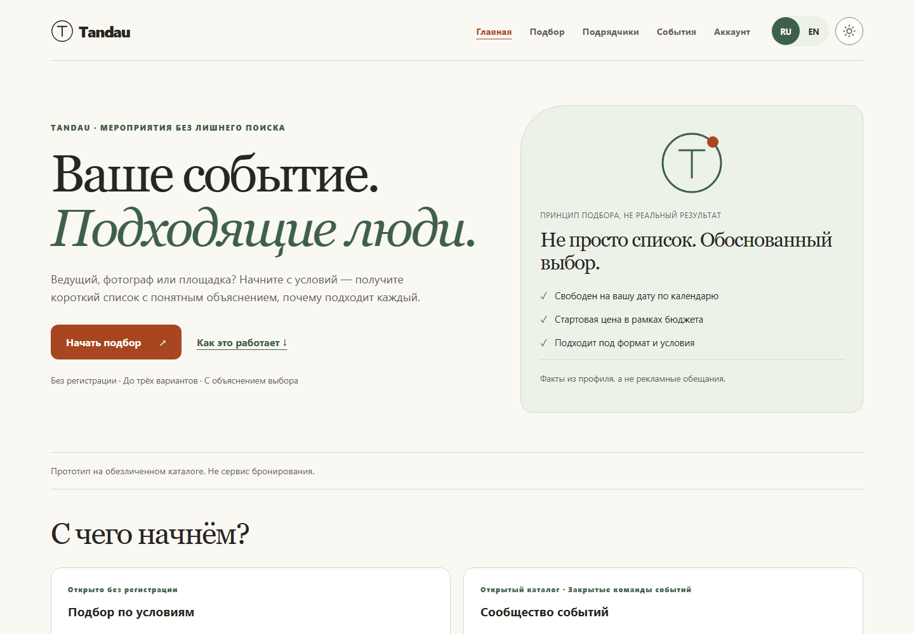
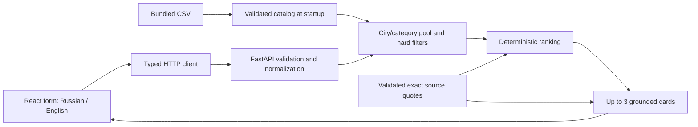

# Tandau — explained contractor matching and event teams

Orbit Digital | Icarus · hackathon task **#79-lite**

Find an event contractor in Kazakhstan without searching a long catalog. Enter the city, date, event format, category and budget to receive **up to three eligible profiles**, each with a short explanation and inspectable evidence. A date change can change the shortlist; a rare category can return one card; an empty result explains what prevented a match.

**Browse and match without an account.** Providers can also create a local account and publish their own listings. Signed-in users can assemble an event team from those listings, edit service-specific checklists, request each provider's agreement and discuss the event in a private group chat. The community directory is separate from the unchanged organizer CSV: nobody can impersonate an anonymized source profile. This is a local prototype, not a deployed booking/payment service. See the [community walkthrough](docs/community.md) and [Demo Day scorecard](docs/release-review.md).

**Live demo:** [http://80.78.18.242](http://80.78.18.242/) runs `main` on the team's server as the same single-server app that `python start.py` starts locally. No account or API key is needed. The local setup below remains the reference way to run and verify the project.

## Run from a fresh checkout

**Windows: open the downloaded/cloned project folder and double-click [Start Tandau.cmd](<Start Tandau.cmd>).** The launcher installs dependencies, builds the website, starts the application and opens your browser. Keep its window open while using Tandau; press **Ctrl+C** there to stop (answer **Y** if Windows asks to terminate the batch job). `Start Orbit.cmd` remains a compatibility shortcut.

**Install once if missing:** [Python 3.11 or newer](https://www.python.org/downloads/) and [Node.js 24 LTS](https://nodejs.org/en/download) (includes npm). On Windows, enable **Add Python to PATH** if offered, then reopen the project folder after installing. These runtimes are prerequisites, not bundled installers; the launcher explains if either is missing. The first launch needs internet and may take a few minutes. Subsequent unchanged launches reuse the installation and build.

Prefer a terminal? After cloning, run **one command** from the project folder:

```bash
python start.py
```

Use `python3 start.py` on macOS/Linux, or `py -3 start.py` on Windows if `python` is unavailable. Including the clone, the complete terminal path is:

```bash
git clone https://github.com/BAITC-Hacks/hack-890ebfb3-orbit-digital-icarus.git
cd hack-890ebfb3-orbit-digital-icarus
python start.py
```

Tandau normally opens at **http://127.0.0.1:8765**. If that port is occupied, the launcher chooses another available port and prints/opens the correct address. One local server serves both the website and real API. **No API key, external account, Docker, database server, environment file, virtual-environment activation or second terminal is needed.** Browsing/matching needs no login. Publishing and event collaboration use optional local accounts; SQLite storage is created automatically. Group messages stay in this app; no emails, external notifications or paid model requests are sent.

Local setup lives in ignored `.orbit/` and `frontend/node_modules`; the built website is in ignored `frontend/dist`. Changed lockfiles trigger installation again; changed frontend source triggers a rebuild. Setup does not overwrite a developer's `.venv`. The launcher forces real API mode, even if a design-preview environment setting is present.

Local accounts, listings and chats persist in **`.orbit/community.sqlite3`**, separate from the source catalog. Treat this file and its backups as private; they are gitignored. Do not delete `.orbit/` to clear a build cache if you want to keep your community data.

### Verify it in two minutes — no coding required

1. The browser opens the **home page**, not an already-submitted order. Click **Начать подбор / Start matching**.
2. Select **Алматы / Ведущий / свадьба / 11 October 2026 / budget 3000000**; leave duration and working language blank. Submit: three cards appear from five eligible profiles. Expand supporting evidence on one card.
3. Change only the date to **10 October 2026** and submit again. The shortlist changes. Repeat without edits: the same cards stay in the same order.
4. Try **Алматы / Флорист / свадьба / 10 October 2026 / budget 300000**: one eligible card appears, with a clear shortfall and imputed-price notice. Open **Contact / prepare inquiry**: it creates copyable text and clearly says nothing was sent or booked.

For both empty outcomes, venues, optional constraints and exact expected IDs, follow [the main scenario below](#try-the-main-scenario) and the [complete demo](docs/demo.md). Developers can reproduce the automated checks in the optional sections below. API readiness and interactive docs are at `/api/health` and `/docs` on the address printed by the launcher.

### Technologies at a glance

**React + TypeScript + Vite** provide the bilingual light/dark interface; **Python + FastAPI + Pydantic + Uvicorn** validate requests and serve the application. Matching uses the bundled **CSV** and reviewed **JSON evidence**, with deterministic filtering/ranking and no runtime model call. **SQLite** stores the separate community workspace. **pytest, Vitest and Playwright** cover domain logic, permissions, UI behavior and browser journeys. Detailed versions and module ownership are in [Architecture](#architecture-and-repository-map).

### Troubleshooting

| What you see | What to do |
| --- | --- |
| Python or Node is missing/unsupported | Install the versions linked above, reopen the launch window, then try again. Supported Node range: `^22.12.0 || ^24.0.0 || >=26.0.0`. |
| First installation fails | Check internet access to Python/npm package registries; relaunch to retry. The window shows the last error lines; full setup output is in `.orbit/setup.log`. Do not publish that log without checking it for machine-specific details. |
| Python cannot create its environment on Linux | Install your distribution's Python venv support (commonly `python3-venv` on Debian/Ubuntu), then relaunch. No administrator access is needed once Python/Node/venv support are installed. |
| Browser does not open | Copy the `Tandau is ready!` address from the launch window into your browser. |
| A specific port is busy | Normally Tandau picks another automatically. To choose one yourself: `python start.py --port 8790`. The launcher never stops another program. |
| You changed frontend code | Stop with Ctrl+C and launch again; the production website is rebuilt when needed. For automatic hot reload use the developer setup below. |

Optional switches: `--no-browser` skips opening a browser; `--prepare-only` installs/builds without starting. Local use is bound to `127.0.0.1`, not exposed to your network. Windows is the locally verified platform; macOS/Linux paths are supported by the launcher but are not claimed as separately verified machines.




[View the English interface](docs/images/interface-en.png) · [Demo walkthrough](docs/demo.md) · [Judging checklist](docs/judging-checklist.md)

## Developer setup (optional)

**Skip this entire section if you only want to run or judge Tandau.** The launcher above does the application setup automatically. This alternative enables hot reload and installs the additional test tools.

<details>
<summary>Expand manual setup, separate dev servers and build preview</summary>

Prerequisites: Git, **Python 3.11+**, and Node matching **`^22.12.0 || ^24.0.0 || >=26.0.0`**, with npm. The current review used Windows 11, Python **3.14.4**, Node **24.15.0** and npm **11.12.1**. Earlier reproduction also passed on Python 3.12.10. No API key, model account, database or environment file is required. Allow about 250 MB for Python and npm dependencies, plus about 700 MB for Playwright Chromium if you run the browser checks. Ports 8000 and 5173 (4173 for the build preview) must be free. The macOS/Linux commands are provided but were not run, because GitHub Actions is unavailable in the organizer's organization.

Run all commands below from the repository root:

```bash
git clone https://github.com/BAITC-Hacks/hack-890ebfb3-orbit-digital-icarus.git
cd hack-890ebfb3-orbit-digital-icarus
git switch main
python -m venv .venv
```

Activate the environment in Windows PowerShell:

```powershell
.venv\Scripts\Activate.ps1
```

Or on macOS/Linux:

```bash
source .venv/bin/activate
```

Install the locked Python, root integration and frontend dependencies:

```bash
python -m pip install -r requirements-dev.lock
python -m pip install -e ".[dev]" --no-deps
python -m pip check
npm ci
npm --prefix frontend ci
npx playwright install chromium
```

The browser installation is needed for browser checks. On Linux machines missing browser system libraries, use `npx playwright install --with-deps chromium` instead.

**Terminal 1 — backend**, with the Python environment activated:

```bash
python -m uvicorn backend.app.main:app --host 127.0.0.1 --port 8000
```

**Terminal 2 — frontend**, from the same repository root:

```bash
npm --prefix frontend run dev -- --host 127.0.0.1 --port 5173 --strictPort
```

Open **http://127.0.0.1:5173** for the home page; choose **Начать подбор / Start matching** or a category. The form also has a direct link at **http://127.0.0.1:5173/#/match**. The frontend proxies `/api` to port 8000. API docs: **http://127.0.0.1:8000/docs**; `/api/health` reports readiness after catalog/evidence validation. Keep both terminals running for HTTP/browser checks. Identify an occupied port's service before stopping it; `--strictPort` prevents silently opening another frontend port.

If PowerShell blocks npm scripts, use `npm.cmd` / `npx.cmd`. You can skip activation and use `.venv\Scripts\python.exe` instead of `python`; no execution-policy change is needed.

The catalog is bundled as `data/contractors.csv`. Setup and matching do not read a developer's Downloads folder or contact an AI provider. `VITE_API_MODE=demo` is an explicit, visibly labeled design-preview option; leave it unset for the real application. API errors never switch to preview data.

### Environment variables

Every variable is optional; the commands above work with none of them set. Examples are in `.env.example` and `frontend/.env.example`. Load a copied backend file with `python -m uvicorn backend.app.main:app --env-file .env`.

| Variable | Used by | Default | Purpose |
| --- | --- | --- | --- |
| `DATA_PATH` | Backend | `data/contractors.csv` | Catalog CSV; relative paths resolve from the repository root |
| `CORS_ORIGINS` | Backend | `http://127.0.0.1:5173,http://localhost:5173` | Comma-separated browser origins allowed to call the API |
| `COMMUNITY_DB_PATH` | Backend | `.orbit/community.sqlite3` | Private local SQLite file, created automatically; relative paths resolve from the repository root |
| `VITE_API_MODE` | Frontend | `api` | `demo` shows a labeled design preview; leave unset for real matching |
| `RUN_APP_SERVERS` | `npm run test:e2e` | unset | `1` lets Playwright start the backend and frontend itself |
| `E2E_BASE_URL`, `E2E_API_URL` | `npm run test:e2e` | local ports 5173 / 8000 | Point browser acceptance at already-running services |
| `NVIDIA_API_KEY`, `OPENAI_API_KEY` | Optional offline evidence tool only | unset | Never needed by the app, tests or checks; prefer `--key-file` outside the repository |

### Build and preview

```bash
npm --prefix frontend run build
npm --prefix frontend run preview -- --host 127.0.0.1 --port 4173 --strictPort
```

The build runs the application TypeScript check and writes `frontend/dist`. Keep the backend running on port 8000 and open **http://127.0.0.1:4173** to check the built bundle locally. Its `/api` proxy and the dense shortlist were verified. This preview is a local build check; an internet deployment still needs a hosted backend and a same-origin `/api` reverse proxy. Static files alone do not provide matching.

</details>

## Try the main scenario

Start on the home page, explain the problem, then click **Начать подбор**. Category cards prefill the form but never submit silently. Budget accepts whole KZT written plainly or with correctly grouped thousands such as `4 000 000`; duration accepts positive dot/comma decimals up to **12 hours inclusive**, or can be left blank. Twelve is the largest defined `max_hours` in the bundled CSV; each contractor's own lower limit still applies. Excessive values show a field error and cannot be submitted; the API also enforces the ceiling. Letters, signs, exponents, badly grouped numbers and malformed pasted values are rejected rather than stripped into another number.

1. Use **Алматы / Ведущий / свадьба / 2026-10-11 / 3,000,000 ₸**, leaving duration and contractor language blank. Five profiles qualify; the first three are `HK-42352 → HK-44923 → HK-27222`.
2. Expand a card's evidence, then switch to English. Interface text and reviewed quote translations change; the IDs, ordering and contractor-language filter stay the same. The original Russian quote remains inspectable.
3. Change only the date to **2026-10-10**. The shortlist becomes `HK-27222 → HK-77838 → HK-72938` because availability and the eligible pool change.
4. Try **Алматы / Флорист / свадьба / 2026-10-10 / 300,000 ₸**. One card, `HK-39372`, is returned. The other florist is booked; the 200,000 ₸ starting price is explicitly marked as imputed.
5. Compare **Астана / Декоратор** with **Астана / Флорист / 2026-10-11 / 300,000 ₸**. The first category is absent in the city; the second exists but has no eligible profile.
6. Try **Астана / Ресторан / свадьба / 2026-10-31 / 4 000 000 ₸**. The category is absent in Astana, so the result offers checked one-field alternatives. Choosing the suggested city **Алматы** runs a new search with the other fields unchanged and returns one eligible profile. Suggestions never change the query without a click.

All dates are in 2026 and prices are per contractor's service. See the [complete demo](docs/demo.md) for venues, December scarcity and the explanation audit.

Each card has **Связаться / подготовить запрос — Contact / prepare inquiry**. It prepares a copyable draft using the returned request and contractor ID. The anonymized dataset has no verified phone/email directory: no invented links, notifications or bookings. Clipboard failure leaves the text selected for manual copying. Home/back navigation preserves the form and shortlist within the tab.

## Architecture and repository map



| Path | Responsibility |
| --- | --- |
| `start.py`, `Start Tandau.cmd`, `backend/app/web.py` | One-command setup, cached production build and one local website/API server |
| `backend/app/catalog.py`, `models.py`, `normalization.py` | Catalog loading, typed boundaries and canonical request validation |
| `backend/app/filtering.py` | Hard constraints and first-failure exclusion counts |
| `backend/app/matching/` | Ranking, evidence validation and card construction |
| `backend/app/api/routes.py`, `main.py` | HTTP responses, startup validation and dataset/algorithm versions |
| `backend/app/insights.py` | Recomputed date-only comparison: booked versus displaced from the top three |
| `backend/app/community/` | Isolated local accounts, provider-owned listings, templates, consent and private event chat |
| `data/contractors.csv` | Unchanged organizer-supplied 66-profile catalog |
| `frontend/src/App.tsx`, `frontend/src/styles/app.css` | Form, cards, evidence, loading/error states and responsive presentation |
| `frontend/src/api/` | Typed transport, runtime response checks and opt-in design preview |
| `frontend/src/community/` | Public provider directory, account dashboard and signed-in event workspace |
| `frontend/src/i18n/` | Russian/English labels, evidence translations and locale checks |
| `contracts/` | Published OpenAPI contract and three response examples |
| `backend/tests/`, `frontend/src/**/*.test.ts` | Backend, transport and localization checks |
| `tests/ui/`, `playwright.ui.config.ts` | Isolated browser checks with explicitly mocked API responses |
| `tests/e2e/`, `playwright.config.ts` | Browser acceptance against the running application |
| `scripts/` | Independent dataset oracle, live HTTP checks, browser timing and offline evidence review tools |
| `.github/workflows/enjoy-checks.yml` | Locked setup, tests, build and real-browser checks; manual trigger only, see [Automated checks](#automated-checks) |
| `Instructions.md`, `docs/` | Shared architecture, responsibilities, demo, evidence and integration notes |

### Technology stack

Backend: Python 3.11+, FastAPI, Pydantic and Uvicorn. The source catalog is held in memory; the optional community module uses Python's built-in SQLite, with no database server to install. Frontend: React 19, TypeScript and Vite with plain CSS. Tests: pytest, HTTPX, Vitest, Testing Library with jsdom, and Playwright with Chromium.

Backend dependencies are pinned to FastAPI **0.136.1**, Pydantic **2.13.3**, Uvicorn **0.46.0**, pytest **9.1.1** and HTTPX **0.28.1**, with resolved dependencies and platform markers in `requirements-dev.lock`. The UI uses React **19.1.1**, Vite **7.3.6** and TypeScript **5.9.2**. Root integration tools separately pin Playwright **1.63.0**, Vitest **5.0.1** and TypeScript **5.8.3**. Both npm packages have lockfiles. The app launcher installs only frontend npm dependencies; root `npm ci` is additionally required for developer verification tools.

## Matching rules

City and category define the candidate pool. Date, starting price, supported event format, optional working language and optional duration are hard constraints. No filter is silently relaxed. Ranking and card construction repeat eligibility checks to catch integration mistakes.

For each eligible profile:

```text
relevance = min(2, number of distinct reviewed quotes tagged for the requested format)
headroom = floor(100 × (budget_kzt − price_from_kzt) / budget_kzt)
score = 1000 × relevance + headroom
order = score descending, starting price ascending, contractor ID ascending
```

Return the first three, preserving this order. Generic quotes with no format tags earn no relevance points. Headroom is measured above a **starting price**; it is not a final saving. The score is a transparent heuristic, not a confidence percentage or a contractor quality rating. Synthetic and imputed flags do not affect the score.

The same normalized request, dataset and evidence/ranking version produce the same result even when source rows are shuffled. There is no random shuffle, current-clock dependency or runtime model call. `algorithm_version()` combines the ranking version with an evidence digest; scoring-rule changes require a version bump.

Only the first failed condition is counted per candidate, in the order `booked → over_budget → unsupported_format → unsupported_language → duration_exceeded`. These mutually exclusive counts sum to the pool size minus eligible profiles. An over-budget result is never described as evidence that everyone is booked.

### Grounded explanations and the AI role

Cards have two concise sentences: structured fit facts, followed by an attributed profile quote or a factual fallback. Each explanation carries evidence fields `code`, `field`, `value` and `source_quote`. Description quotes must be exact substrings of the same contractor's original description.

The coding assistant reviewed all 66 descriptions and curated **99 exact quote records**, labeled `agent-reviewed-extractive`. Six weak records are excluded from explanation prose. The other **93 quotes have reviewed English translations**; English cards retain an expandable original Russian quote. This is development-time agent review, not independent verification of contractor claims. Descriptions are data, never instructions.

Startup validates the actual CSV hash against the evidence artifact and rejects unknown IDs, fabricated quotes, unsupported tags and malformed records. Missing usable evidence for a known profile uses structured facts; broken or stale evidence is an error. See [evidence review](docs/evidence-review.md) for conservative tagging and sparse-description limitations.

The optional [NVIDIA/OpenAI proposal workflow](docs/offline-evidence.md) supports future catalog growth. It defaults to a dry run, selects one provider explicitly, caps combined attempts at three per local ledger, caches successful requests, and requires separate semantic review. Keys are read only for explicit execution from a provider environment variable or a file outside the repository; keys never belong in Git or the browser. The app and automated tests make no paid inference calls.

One OpenAI smoke request used **501 tokens**; a cached replay made no further call. Review rejected a proposed divorce statistic despite exact source containment, and the proposal was not adopted. The NVIDIA attempt returned HTTP 401 without retry. These are recorded workflow checks, not runtime features or evidence of remaining account credit.

## Data and practical limits

The organizer supplied **66 profiles**, **17 overlapping category labels**, **13 synthetic profiles**, **8 imputed cities**, **18 imputed starting prices** and **9 null duration limits**. Cities are Алматы, Астана and Зарубежье. Multi-category profiles retain one identity and calendar. Every bundled profile has `source_kind: provided`; supplied synthetic records were not added by the team.

Source materials: [CSV](https://drive.google.com/file/d/1uUCu-szctwaTaV0-Yfg3FKHY8M3lQ3vw/view), [HTML preview](https://drive.google.com/file/d/1IZhWdv53wujvRMHWTA47t9V1UqulmMPs/view), [official task and criteria](https://docs.google.com/document/d/1rhR2HFY164BrnkIP39N3usY9fNY4JeAgkPxEzbqL00w/edit?tab=t.9tqw3yk75922). Source CSV SHA-256:

```text
6a724b6b7dfb5973343e68ba18dadb60fc807d87e3d78f03ee86fb26cb089f7d
```

- Calendar coverage is **2026-09-23 through 2026-12-31 inclusive**. Other dates are rejected. “Free” means free in the supplied snapshot, not a confirmed live reservation.
- Prices are positive integer KZT and are presented as starting prices. Equality with budget passes. Imputed prices/cities and synthetic profiles have visible notices; a final quotation still needs confirmation.
- `max_hours = null` means attendance duration does not apply to the service; it does not promise unlimited attendance.
- Contractor working language is an optional eligibility filter. The Russian/English interface switch is separate and does not change it.
- A travel or marketing claim in prose cannot override structured city, availability, price or other hard constraints.
- Sparse descriptions limit how distinctive an explanation can be. The application does not verify claims, negotiate, take payment, make bookings or guarantee contractor quality.

## API

| Endpoint | Result |
| --- | --- |
| `GET /api/health` | `status: ready`, profile count, dataset hash and algorithm version after successful startup |
| `GET /api/metadata` | Canonical cities, categories, formats and languages, plus `calendar_start` / `calendar_end` |
| `POST /api/match` | Normalized request, versions, counts, exclusions, status and zero to three cards |
| `POST /api/insights/dates` | Compare two otherwise identical requests; explain removed/added shortlist IDs without guessing from aggregate counts |
| `/api/community/*` | Separate authentication, listings, templates, invitations and chat; interactive schema at `/api/community/docs` |

Example request:

```json
{
  "city": "Алматы",
  "event_date": "2026-10-10",
  "event_format": "свадьба",
  "category": "Флорист",
  "budget_kzt": 300000,
  "duration_hours": null,
  "language": null
}
```

The verified result has one card, `HK-39372`, from a pool of two florists; the other is booked. The envelope includes `schema_version`, normalized `request`, dataset/algorithm versions, `message`, `counts`, `exclusions` and `cards`.

| HTTP 200 outcome | Meaning |
| --- | --- |
| `matches_found` | At least one eligible profile; return at most three without padding |
| `category_absent` | No profiles in the requested city's category pool |
| `no_eligible_contractors` | The pool exists but every profile fails a hard constraint |

Invalid fields, unsupported catalog values and dates outside the calendar return **HTTP 422**. Network errors, server failures and malformed successful responses are distinct error states with retry. The frontend preserves input and server order, cancels superseded requests and prevents an old response from replacing a newer form state.

The core TypeScript declarations are manually aligned with [the published matching contract](contracts/openapi.json). Transport tests exercise all three response examples and runtime guards. Extension schemas are available at `/api/insights/openapi.json` and `/api/community/openapi.json`. See [integration details](docs/integration.md), [browser contract](docs/browser-contract.md) and [community permissions](docs/community.md).

## Reproduce the checks

These commands are for developers, not prerequisites for judging the UI. Complete the optional developer setup above (including root npm and Playwright installation) and activate its `.venv`. The launcher alone does not install the root browser-test tooling. These checks require no running backend:

```bash
python -m pytest -q
python scripts/matching_acceptance.py --repeat 20
python scripts/validate_evidence_proposal.py --input backend/app/matching/profile_evidence.json
npm run test:client
npm run test:i18n
npm run test:numeric
npm --prefix frontend test
npm run typecheck:client
npm --prefix frontend run build
npm run test:ui
```

`test:ui` starts Vite with explicit mocked metadata/match responses. Its 16 flows check numeric editing, metadata retry and localization independently; they are not backend acceptance evidence. The domain acceptance tool independently loads and filters the bundled data and checks frozen ordered IDs and repeatability.

With the real backend and frontend running in the two terminals:

```bash
python scripts/check_api.py --base-url http://127.0.0.1:8000 --repeat 20
npm run test:e2e
npm run measure:browser
node scripts/capture_release.mjs
```

The HTTP checker compares actual responses with the independent dataset oracle. The real-browser suite drives the application, checks cards and outcomes, and exercises controlled failure/retry and delayed-response boundaries. The measurement script makes real matching requests with no fixture interception and saves a local report under ignored `artifacts/`.

To let Playwright start both services itself, activate `.venv` and set `RUN_APP_SERVERS=1` before `npm run test:e2e` (`$env:RUN_APP_SERVERS="1"` in PowerShell, or `RUN_APP_SERVERS=1 npm run test:e2e` on macOS/Linux). `E2E_BASE_URL` and `E2E_API_URL` select already-running services. `npm run test:e2e:list` only discovers tests; it does not execute them.

To check the one-command production server instead, leave `RUN_APP_SERVERS` unset and point **both** `E2E_BASE_URL` and `E2E_API_URL` to its printed address. For example, in a second PowerShell window after developer test-tool installation:

```powershell
$env:E2E_BASE_URL="http://127.0.0.1:8765"
$env:E2E_API_URL=$env:E2E_BASE_URL
npm.cmd run test:e2e
```

### Recorded local verification

**Current Tandau/community checks:** see [the new integration verification](docs/community-verification.md) for provider accounts, multi-person consent/chat, themes and date comparison. The table below is the historical pre-extension baseline, not a claim that its old commit hashes contain the new features.

Latest verified source (`978c002`): **277 Python tests + 265 subtests**, **66 component tests**, **95 client / 17 locale / 10 numeric units**, **16 isolated + 16 real browser journeys**, TypeScript and production build. A clean clone launched automatically; after the final palette update it rebuilt and repeated the component/browser checks successfully. Matching source data and frozen results remain unchanged. This is local Windows evidence, not a cloud-CI or production-scale claim.

| Check | Result |
| --- | --- |
| Python suite | **152 passing tests and 265 subtests**, including 35 launcher/static-serving checks, duration boundaries, strict types, JSON-safe errors, verified alternatives and published OpenAPI parity |
| Transport, locale and numeric unit tests | **95 client + 17 localization + 10 numeric tests passing**, including grouped budgets such as `4 000 000` |
| React components | **19 tests passing**, including grouped and malformed budgets, duration limits/recovery, home and inquiry/clipboard behavior |
| Strict transport types / full frontend build | **Passing** |
| Isolated mocked browser UI | **16 Chromium tests passing**, including duration limits and number entry after rejecting letters/pastes |
| Application browser acceptance | **13 Chromium tests passing**: matching, alternatives, home/navigation and inquiry journeys |
| Domain and real HTTP scenarios | **8 scenarios × 20 repeats = 160 runs** in each check |
| Built-bundle preview | All **13 application E2E tests passed again** through the local port 4173 production preview |
| One-command fresh-clone launch | **Passed at `6ee3714`**, including the dark theme: automatic locked installation/build, 152 Python tests / 265 subtests, 160 HTTP requests and 13 real-browser flows on one server; cached relaunch and shutdown checked. See [launcher verification](docs/launcher-verification.md) |
| All three branches integrated | The suites above were rerun on 23 September 2026 after combining `Enjoy`, `bbl`, `feature/sp3ctra` and the latest `main` |
| Complete integrated fresh-clone reproduction | **Passed at `1292b65`** with fresh locked installs and 160 real HTTP requests; all suites/build passed again at **`190696c`** after three more teammate tests, with unchanged application/dependencies; see the [verification record](docs/reproducibility.md) |

Measurements on **23 September 2026**, Windows 11, Python 3.14.4 and Chromium **153.0.8010.12**, with the CSV hash above and algorithm `explainable-v1:2553919e464d7030`:

| Scope | Runs | p95 | Maximum |
| --- | ---: | ---: | ---: |
| Real local HTTP requests across eight scenarios | 160 | **23.327 ms** | **45.550 ms** |
| Real browser submit-to-visible result across five scenarios | 20 | **74.730 ms** | **113.900 ms** |

Browser timing includes automation click/wait overhead. These local measurements exclude installation and server startup; they do not predict internet hosting latency or production throughput. The measured local flows are below the task's ten-second target. Rerun the commands to measure the current machine and versions.

### Automated checks

`.github/workflows/enjoy-checks.yml` runs the same steps as this section: locked installation, Python, domain acceptance, client, locale, numeric and component checks, the type check, the frontend build and both browser suites. GitHub cannot start any job in the organizer's `BAITC-Hacks` organization. Every run fails in about three seconds with “The job was not started because your account is locked due to a billing issue.” ([example run](https://github.com/BAITC-Hacks/hack-890ebfb3-orbit-digital-icarus/actions/runs/35842404798)). That is an organization billing condition, not a test failure. The workflow is therefore set to manual `workflow_dispatch` only, so pushes do not show false red checks. Run the commands above locally; a green cloud run is not claimed. Restore the `push` and `pull_request` triggers once the organization's Actions billing works.

## Value, judging and next steps

The practical value is a short, repeatable shortlist with reasons the user can inspect. Honest one-card and empty outcomes avoid wasting time contacting unavailable or unsuitable contractors. The original Russian evidence remains available while English labels and reviewed translations make the same workflow accessible to another audience.

| Judging criterion | Points | Implemented evidence |
| --- | ---: | --- |
| Task compliance and functionality | 25 | Real form/API flow, all hard constraints, date-sensitive top three and distinct empty outcomes |
| Technical implementation | 25 | Separate validation/filter/ranking layers, deterministic provenance, typed transport and grounded explanations |
| README and reproducibility | 25 | Bundled source data, locked dependencies, startup commands, scenario scripts and local test evidence |
| Value and applicability | 15 | Inspectable reasons, price/calendar caveats, responsive Russian/English interface and actionable exclusions |
| Development potential and originality | 10 | Versioned extractive evidence, guarded offline proposals, reviewable translations and reproducible matching |

The separate Demo Day rubric supplied by the captain weights value/result/innovation/scaling/presentation as **25/20/15/20/20**. The optional provider/event workflow adds authenticated publishing, editable service templates, explicit agreement and private team discussion; its [demo and permission boundaries](docs/community.md) support that presentation without changing the original matching brief. Those weights are opportunities to demonstrate evidence, not points already earned.

See the [technical judging checklist](docs/judging-checklist.md), [Demo Day scorecard and pitch](docs/release-review.md), and [earlier clean-clone verification](docs/reproducibility.md). Remaining human work is rehearsal, portal submission and cloud CI follow-up if the account still blocks jobs. User-approved one-condition alternatives are implemented. Live calendars, verified contact onboarding, confirmed quotations, feedback evaluation and larger-catalog retrieval remain future work. Rubric weights are not earned scores or a guarantee of winning.

Team ownership: **Enjoy** (`Enjoy` branch) — matching, evidence, integration and verification; **bbl** (`bbl` branch) — backend models, catalog and filtering; **spectra** (`feature/sp3ctra` branch) — interface design and frontend. Integration uses team pull requests and captain-authorized tested updates to `main`. Remote updates/contracts are checked before merging; archived pre-rewrite branches are preserved rather than merged a second time. See [Instructions.md](Instructions.md) and [team synchronization notes](docs/team-sync.md).

### Organizer reminder and submission

The additional organizer notice supplied on 23 September requires the README to explain **the problem, launch, technologies and verification without team assistance**; the opening sections address all four. Finishing early is an opportunity to improve and rehearse, not permission to leave: **team members must remain at the venue until 18:00, per the supplied organizer notice**. The captain still needs to verify current official instructions, submit the correct repository/demo links and confirm the submission receipt. This repository cannot verify physical attendance or guarantee a judging score.

## Third-party components, data and AI tools

Disclosed under the hackathon rules on third-party materials. The matching, filtering, API, interface and test code was developed by the team during the competition, with the AI assistance described below.

| Component | Version | License | Use |
| --- | --- | --- | --- |
| FastAPI | 0.136.1 | MIT | HTTP API |
| Pydantic | 2.13.3 | MIT | Request and response validation |
| Uvicorn | 0.46.0 | BSD-3-Clause | ASGI server |
| pytest, HTTPX | 9.1.1, 0.28.1 | MIT, BSD-3-Clause | Backend tests |
| React, React DOM | 19.1.1 | MIT | Interface |
| Vite, @vitejs/plugin-react | 7.3.6, 5.0.2 | MIT | Frontend build and dev server |
| TypeScript | 5.9.2 (frontend), 5.8.3 (root) | Apache-2.0 | Type checking |
| Vitest, Testing Library, jsdom | 5.0.1, 16.3.0, 26.1.0 | MIT | Unit and component tests |
| Playwright | 1.63.0 | Apache-2.0 | Browser automation |
| Downloaded Chromium | 153.0.8010.12 in recorded checks | BSD-style and component-specific licenses; [upstream notice](https://chromium.googlesource.com/chromium/src/+/HEAD/LICENSE) | Browser tests |
| GitHub Actions `checkout`, `setup-python`, `setup-node` | v4, v5, v4 | MIT | Manual CI workflow |

Full resolved dependency sets are in `requirements-dev.lock`, `package-lock.json` and `frontend/package-lock.json`. Transitive licenses are MIT, ISC, BSD and Apache-2.0, plus the dev-only MPL-2.0 `lightningcss` and CC-BY-4.0 `caniuse-lite` data.

- **Dataset:** `data/contractors.csv` is the unchanged organizer-supplied catalog, including its 13 synthetic profiles, imputed values and calendar. The team added no source profiles. User-published community listings live separately in the private local database and are labeled unverified; they never enter the source matching score.
- **Design:** [`design.pdf`](design.pdf), five screens, and the interface design were made by the team for this project. Screenshots in `docs/images/` are captures of this application. No icon library or stock images are used.
- **Fonts:** no font files are bundled or downloaded. The CSS names Inter, used only if it is installed locally; otherwise Georgia and system fonts apply.
- **AI coding assistants:** OpenAI Codex and Anthropic Claude Code were used as development tools for code, tests, reviews and documentation, as the rules allow. The 99 quote records in `backend/app/matching/profile_evidence.json` and the 93 English quote translations in `frontend/src/i18n/evidence.en.json` were prepared with an AI coding assistant, then checked automatically for exact source substrings, known IDs and valid tags. The team directed, reviewed and tested the work.
- **AI in the product:** none at runtime. The optional offline evidence tool in `scripts/propose_evidence.py` can call NVIDIA's hosted API (default `nvidia/mistral-nemo-minitron-8b-8k-instruct`) or OpenAI Chat Completions (default `gpt-4.1-mini-2025-04-14`) with the operator's own key. Both OpenAI proposals were rejected in review, and the NVIDIA call returned HTTP 401, so no output from that tool is shipped. Matching/tests never need a key or an external personal account. Optional community actions require only a local account created in the app; automated community tests use disposable local accounts. Chat is between participants, not an LLM.
